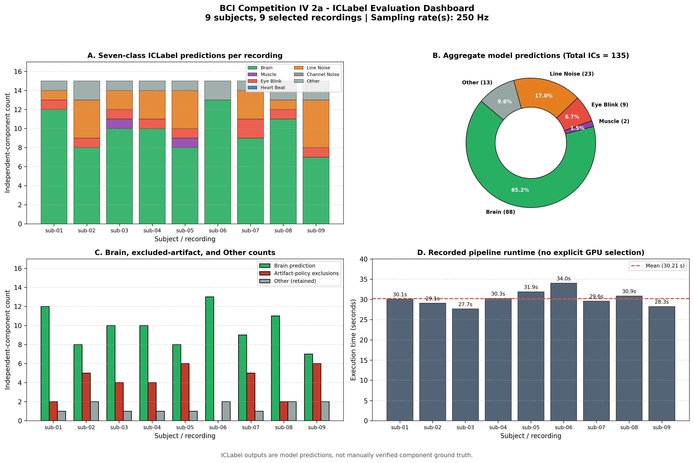
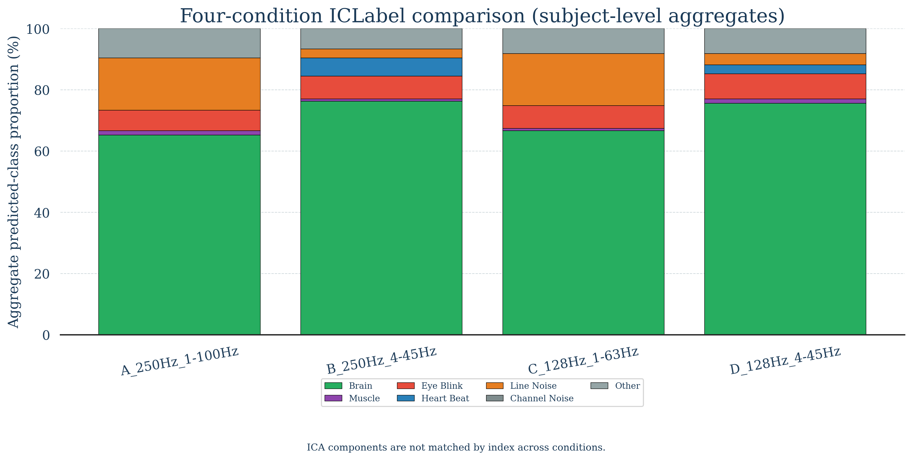

# ICLabel EEG Preprocessing Robustness & Troubleshooting Case Study

This directory is the corrected, publication-oriented version of the EEG/ICLabel work. The original scripts and result folders in the parent directory are preserved as an archive of the troubleshooting process.

## Current status

- The existing BCI Competition IV Dataset 2a results have been reconciled from their per-subject JSON reports.
- The cohort table and dashboard now include all seven ICLabel classes.
- The BCI pipeline records the selected session/run, uses strict montage validation, and no longer claims an unverified GPU benchmark.
- The four-condition controlled comparison has been executed successfully for all nine subjects (36 condition-level fits; 540 ICLabel predictions; zero failed conditions).
- The DEAP and BCI conclusions have been rewritten as a preprocessing-robustness case study rather than a new model, clinical validation, or proof of a universal Nyquist bug.

## Verified reconciliation of the existing BCI run

The original run evaluated nine subjects with 15 independent components per selected recording, for 135 ICs total. The corrected accounting is:

| Category | Count | Percentage of all 135 ICs |
|---|---:|---:|
| Brain prediction | 88 | 65.2% |
| Artifact-policy exclusions | 34 | 25.2% |
| Other prediction | 13 | 9.6% |

The previous dashboard omitted `Other` and `Channel Noise`, so its donut chart used 122 rather than 135 as the denominator and displayed an incorrect Brain percentage of 72.1%. The corrected dashboard uses `Total ICs` as the denominator and validates that all seven classes reconcile on every row.



These values are ICLabel model predictions, not manually verified component ground truth. “Artifact-policy exclusions” means the existing pipeline excluded ICs whose argmax class was one of Muscle, Eye Blink, Heart Beat, Line Noise, or Channel Noise.

## Scope of the existing BCI result

Dataset 2a provides two sessions with six runs per session for each subject. The original code selected the first available session and first available run with `[0]`, so it evaluated one of the 12 runs returned for each subject. Therefore the existing 135-IC result supports this statement:

> Nine subjects were evaluated using one selected recording per subject from BNCI2014_001.

It does not support a claim that every session and run for all nine subjects was processed. The corrected pipeline records session and run identifiers, and it offers `--all-recordings` for a broader rerun.

## Controlled comparison

`src/controlled_experiment/run_controlled_experiment.py` refits ICA separately under four conditions while keeping subject, selected recording, channel handling, reference, ICA method, random seed, and component target fixed:

| Condition | Sampling rate | Passband | Purpose |
|---|---:|---:|---|
| A | 250 Hz | 1–100 Hz | BCI/ICLabel-oriented baseline |
| B | 250 Hz | 4–45 Hz | DEAP-like passband at 250 Hz |
| C | 128 Hz | 1–63 Hz | 128 Hz with a Nyquist-limited passband |
| D | 128 Hz | 4–45 Hz | DEAP-like sampling rate and passband |

The clean contrasts are A vs B (passband at 250 Hz), B vs D (sampling rate with a shared 4–45 Hz passband), and C vs D (passband at 128 Hz). A vs C is descriptive because both sampling rate and feasible upper bandwidth differ.

ICA components are not paired by component number across conditions. `IC 3` after one ICA fit is not assumed to correspond to `IC 3` after a different fit. Comparisons are made using subject-level class proportions and confidence summaries.

### Completed controlled-comparison results

The experiment completed for nine subjects using one consistently selected recording per subject and 15 ICA components per condition. Every condition therefore contains 135 predictions.

| Condition | Brain | Muscle | Eye Blink | Heart Beat | Line Noise | Channel Noise | Other |
|---|---:|---:|---:|---:|---:|---:|---:|
| A: 250 Hz, 1–100 Hz | 65.19% | 1.48% | 6.67% | 0.00% | 17.04% | 0.00% | 9.63% |
| B: 250 Hz, 4–45 Hz | 76.30% | 0.74% | 7.41% | 5.93% | 2.96% | 0.00% | 6.67% |
| C: 128 Hz, 1–63 Hz | 66.67% | 0.74% | 7.41% | 0.00% | 17.04% | 0.00% | 8.15% |
| D: 128 Hz, 4–45 Hz | 75.56% | 1.48% | 8.15% | 2.96% | 3.70% | 0.00% | 8.15% |

The clean sampling-rate contrast (B vs D, both 4–45 Hz) was similar at the aggregate level: Brain differed by 0.74 percentage points and Line Noise by 0.74 points. The passband contrasts (A vs B and C vs D) produced larger changes, especially a lower Line Noise proportion and a higher Brain proportion under 4–45 Hz. This result does not establish a universal causal rule: ICA was refitted per condition and ICLabel outputs are predictions rather than component ground truth.



## Reproduce the corrected artifacts

The pipeline was tested with Python 3.10. From this directory, activate an
environment containing `requirements.txt`, then run:

```powershell
$python = 'python'

& $python .\src\bci\reconcile_existing_results.py
& $python .\src\bci\generate_summary_plots.py
```

Run the corrected BCI pipeline on the first selected recording per subject:

```powershell
& $python .\src\bci\run_bci_batch_pipeline.py
```

Run it across every session/run returned by MOABB:

```powershell
& $python .\src\bci\run_bci_batch_pipeline.py --all-recordings
```

Run the controlled comparison (downloads BNCI2014_001 through MOABB if it is not cached):

```powershell
& $python .\src\controlled_experiment\run_controlled_experiment.py
```

The script reads the configured MNE cache by default. To provide it explicitly
(and avoid MOABB 1.5 creating a malformed `C-` path on Windows), use:

```powershell
& $python .\src\controlled_experiment\run_controlled_experiment.py `
  --data-cache "$HOME\mne_data"
```

For a one-subject smoke run:

```powershell
& $python .\src\controlled_experiment\run_controlled_experiment.py --subjects 1
```

## Repository layout

```text
final/
├── README.md
├── requirements.txt
├── src/
│   ├── bci/
│   └── controlled_experiment/
├── docs/
│   └── methodology.md
├── reports/
│   ├── final_findings.md
│   └── troubleshooting.md
├── figures/
└── results/
    └── summary_tables/
```

Raw DEAP/BCI files, reconstructed FIF files, archives, credentials, and dataset caches are excluded from Git. The DEAP license restricts redistribution, so users should obtain it from the official source under its own terms.

No repository license has been selected yet. Add one only after deciding how the project code should be reused; a code license does not override dataset licenses.

## Evidence-aware interpretation

- MNE-ICALabel documents ICLabel as designed around extended Infomax ICA, common-average reference, and 1–100 Hz filtered EEG. It also states that the model can run outside those specifications and that the preprocessing effects were not established in the original ICLabel paper.
- The preprocessed DEAP package is 128 Hz and bandwidth-limited; increasing a later software filter cutoff cannot restore frequencies already removed upstream.
- The existing BCI comparison shows that the unusual DEAP Heart Beat pattern did not repeat in the selected 250 Hz BCI recordings. It does not by itself prove that sampling rate alone caused the DEAP behavior.
- A defensible current conclusion is that the DEAP anomaly is consistent with a broader preprocessing/data mismatch and requires the controlled comparison before stronger causal language is used.

## Primary references

- [MNE-ICALabel: automatic ICLabel example](https://mne.tools/mne-icalabel/stable/generated/examples/00_iclabel.html)
- [MNE-ICALabel `label_components` API](https://mne.tools/mne-icalabel/stable/generated/api/mne_icalabel.label_components.html)
- [BCI Competition IV Dataset 2a description](https://www.bbci.de/competition/iv/)
- [Official DEAP download page](https://eecs.qmul.ac.uk/mmv/datasets/deap/download_split.html)
- [Official DEAP EULA](https://www.eecs.qmul.ac.uk/mmv/datasets/deap/doc/eula.pdf)
- [Original ICLabel classifier paper](https://doi.org/10.1016/j.neuroimage.2019.05.026)
- [Original DEAP paper](https://doi.org/10.1109/TAFFC.2011.15)
