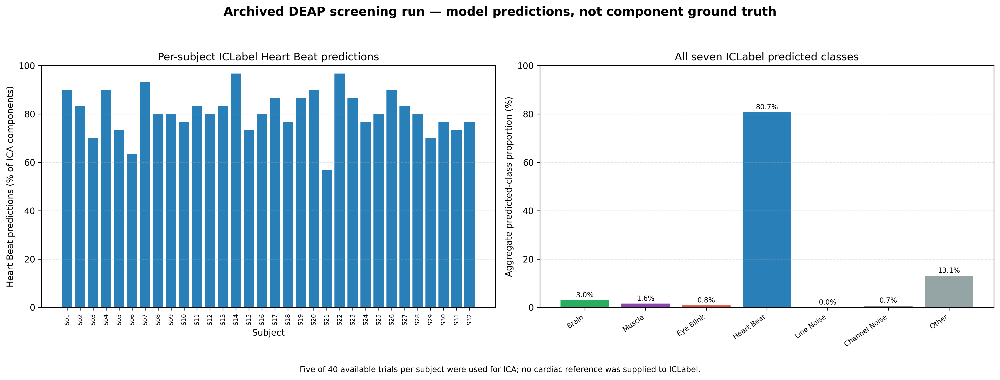
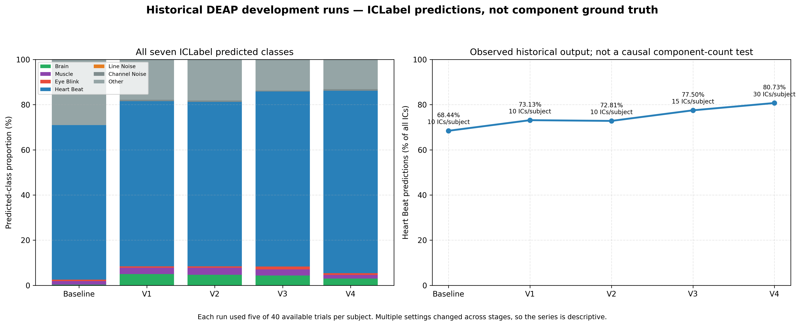

# ICLabel EEG Preprocessing Robustness and Troubleshooting Case Study

## Overview

This repository investigates an anomalous ICLabel output distribution observed during an analysis of preprocessed DEAP EEG data. It documents the original analysis, the subsequent troubleshooting sequence, the reconciliation of previously generated results, and a controlled comparison using BCI Competition IV Dataset 2a.

The project evaluates how dataset and preprocessing conditions may affect ICLabel predictions. It does not introduce a new classifier and does not establish component ground truth. All reported ICLabel class assignments are model predictions and must not be interpreted as confirmed artifacts, clinical findings, or biological discoveries.

## Problem statement

In the archived final DEAP screening run, 775 of 960 independent components (80.73%) were predicted as `Heart Beat`. This unusually dominant prediction pattern was scientifically suspicious and required further investigation.

The ICLabel DEAP experiments in this repository were performed on the distributed preprocessed DEAP Python files, not on the original raw DEAP recordings. In the Kaggle package used by the project, the implemented analyses read `s01.dat` through `s32.dat` from `data_preprocessed_python`; no raw/original EEG recording directory was used by the pipeline.

At the beginning of the project, the downloaded DEAP package was initially assumed to represent the dataset used for the planned EEG analysis, and its upstream preprocessing status had not yet been identified. During subsequent troubleshooting and dataset-provenance inspection, we confirmed that the analysis files were the distributed `data_preprocessed_python` version rather than the original BioSemi/BDF recordings. This discovery changed the interpretation of the DEAP results and introduced upstream preprocessing as an explicit limitation of the study.

No claim is therefore made that the present DEAP analysis characterizes ICLabel behavior on the original raw DEAP recordings.

Because upstream preprocessing had already been applied before the present ICA/ICLabel workflow, its potential influence on the anomalous prediction distribution cannot be isolated from the current experiment and should be treated as a dataset-level limitation rather than a confirmed causal explanation.

The standard preprocessed DEAP package contains 32 EEG channels followed by eight peripheral channels. It has no dedicated ECG channel, but it does include a Plethysmograph/BVP channel. This pipeline supplied only the first 32 EEG channels to ICA and ICLabel, so the BVP channel was not an ICLabel input. The resulting `Heart Beat` assignments were inferred from EEG independent components rather than directly from ECG/BVP input.

The absence of a cardiac reference from the ICLabel input does not by itself prove that the predictions were wrong, because cardiac activity can propagate into scalp EEG. It does mean that no ECG or BVP reference was used to directly validate those assignments as confirmed cardiac artifacts.

The historical Baseline-to-V4 troubleshooting sequence changed several variables, including channel mapping, downstream filtering requests, trial-boundary handling, ICA component count, and rank-selection logic. Because multiple variables changed and ICA was refitted at each stage, this sequence is descriptive rather than a controlled one-factor experiment. It cannot identify any individual setting as the unique cause of the anomalous distribution.

## Research questions

This project addresses the following questions:

1. Can the previously generated BCI and DEAP outputs be reconciled consistently across all seven ICLabel classes?
2. Which conclusions are supported by the historical troubleshooting sequence, and which earlier causal claims must be rejected?
3. How do sampling rate and passband affect aggregate ICLabel predictions when they are compared more systematically?
4. Can model predictions be reported separately from decisions to exclude components or reconstruct EEG signals?

The original BCI analysis evaluated one selected recording for each of nine subjects, rather than every available session and run. The subsequent controlled experiment used the same recording scope and evaluated four combinations of sampling rate and passband while keeping the other documented analysis settings consistent.

## Main finding

The following sampling-rate comparison was performed on BCI Competition IV Dataset 2a, not on the original raw DEAP recordings.

Under the shared 4–45 Hz passband, the controlled 250 Hz and 128 Hz conditions produced similar aggregate Brain prediction proportions: 76.30% and 75.56%, respectively.

This result does not support the earlier hypothesis that 128 Hz sampling alone causes a universal ICLabel “collapse.” It also does not establish passband, channel order, component count, rank handling, or any other individual setting as the sole explanation.

The current evidence is consistent with a dataset- and preprocessing-dependent anomaly, but it does not identify the cause of the unusual DEAP distribution. Direct validation requires appropriate reference signals, expert component review, independently labelled ground truth, or a controlled analysis derived from the original raw DEAP recordings. This validation was not omitted by design; it could not be performed because the original recordings were not accessible during the study.

## Current status

- The existing BCI results have been reconciled across all seven ICLabel classes: nine selected recordings, 15 components per recording, and 135 components in total.
- The four-condition controlled BCI experiment completed 36 subject-condition ICA fits and generated 540 component predictions with zero recorded failures.
- The archived final DEAP screening output has been reconciled to 960 components from 32 subjects and 160 trials used for ICA.
- The complete Baseline-to-V4 DEAP development history is preserved under `archive/deap_history/`.
- The public repository preserves reproducible code, reconciled artifacts, and evidence-aware conclusions for academic review.
- Raw or licensed EEG datasets, reconstructed EEG files, credentials, and local filesystem paths are not included.

## Verified reconciliation of the existing BCI run

The original run evaluated nine subjects with 15 independent components per selected recording, for 135 ICs total. The corrected accounting is:

| Category | Count | Percentage of all 135 ICs |
|---|---:|---:|
| Brain prediction | 88 | 65.2% |
| Artifact-policy exclusions | 34 | 25.2% |
| Other prediction | 13 | 9.6% |

The previous dashboard omitted `Other` and `Channel Noise`, so its donut chart used 122 rather than 135 as the denominator and displayed an incorrect Brain percentage of 72.1%. The corrected dashboard uses `Total ICs` as the denominator and validates that all seven classes reconcile on every row.


These values are ICLabel model predictions, not manually verified component ground truth. “Artifact-policy exclusions” describes the archived run, which excluded ICs whose argmax class was one of Muscle, Eye Blink, Heart Beat, Line Noise, or Channel Noise. The current pipeline is prediction-only by default and requires an explicit option before applying this reconstruction policy.

## Scope of the existing BCI result

Dataset 2a provides two sessions with six runs per session for each subject. The original code selected the first available session and first available run with `[0]`, so it evaluated one of the 12 runs returned for each subject. Therefore the existing 135-IC result supports this statement:

> Nine subjects were evaluated using one selected recording per subject from BNCI2014_001.

It does not support a claim that every session and run for all nine subjects was processed. The corrected pipeline records session and run identifiers, and it offers `--all-recordings` for a broader rerun.

## Controlled comparison

`src/controlled_experiment/run_controlled_experiment.py` refits ICA separately under four conditions while keeping subject, selected recording, channel handling, reference, ICA method, random seed, and component target fixed:

| Condition | Sampling rate | Passband | Purpose |
|---|---:|---:|---|
| A | 250 Hz | 1–100 Hz | BCI/ICLabel-oriented baseline |
| B | 250 Hz | 4–45 Hz | DEAP-like passband at 250 Hz |
| C | 128 Hz | 1–63 Hz | 128 Hz with a Nyquist-limited passband |
| D | 128 Hz | 4–45 Hz | DEAP-like sampling rate and passband |

The clean contrasts are A vs B (passband at 250 Hz), B vs D (sampling rate with a shared 4–45 Hz passband), and C vs D (passband at 128 Hz). A vs C is descriptive because both sampling rate and feasible upper bandwidth differ.

ICA components are not paired by component number across conditions. `IC 3` after one ICA fit is not assumed to correspond to `IC 3` after a different fit. Comparisons are made using subject-level class proportions and confidence summaries.

### Completed controlled-comparison results

The experiment completed for nine subjects using one consistently selected recording per subject and 15 ICA components per condition. Every condition therefore contains 135 predictions.

| Condition | Brain | Muscle | Eye Blink | Heart Beat | Line Noise | Channel Noise | Other |
|---|---:|---:|---:|---:|---:|---:|---:|
| A: 250 Hz, 1–100 Hz | 65.19% | 1.48% | 6.67% | 0.00% | 17.04% | 0.00% | 9.63% |
| B: 250 Hz, 4–45 Hz | 76.30% | 0.74% | 7.41% | 5.93% | 2.96% | 0.00% | 6.67% |
| C: 128 Hz, 1–63 Hz | 66.67% | 0.74% | 7.41% | 0.00% | 17.04% | 0.00% | 8.15% |
| D: 128 Hz, 4–45 Hz | 75.56% | 1.48% | 8.15% | 2.96% | 3.70% | 0.00% | 8.15% |

The clean sampling-rate contrast (B vs D, both 4–45 Hz) was similar at the aggregate level: Brain differed by 0.74 percentage points and Line Noise by 0.74 points. The passband contrasts (A vs B and C vs D) produced larger changes, especially a lower Line Noise proportion and a higher Brain proportion under 4–45 Hz. This result does not establish a universal causal rule: ICA was refitted per condition and ICLabel outputs are predictions rather than component ground truth.


## Reconciled DEAP screening run

The archived `ICLabel_DEAP_final.py` run evaluated 32 subjects with 30 ICA components per subject. It had 40 trials available for each subject but used five trials per subject for ICA. The corrected aggregate accounting therefore reports 1,280 trials available and 160 trials used—not 1,280 trials processed by ICA.

| ICLabel predicted class | Count | Percentage of 960 ICs |
|---|---:|---:|
| Brain | 29 | 3.02% |
| Muscle | 15 | 1.56% |
| Eye Blink | 8 | 0.83% |
| Heart Beat | 775 | 80.73% |
| Line Noise | 0 | 0.00% |
| Channel Noise | 7 | 0.73% |
| Other | 126 | 13.13% |

The 775 Heart Beat calls are an anomalous ICLabel prediction pattern, not confirmation that 775 components were cardiac artifacts. Only the first 32 EEG channels were supplied to ICLabel. The package's peripheral BVP channel was excluded from that input, and no dedicated ECG channel exists in the package, so no cardiac reference was used to directly validate the assignments. This does not prove that the predictions were wrong, because cardiac activity can propagate into scalp EEG. The publication-safe pipeline reports predictions and probabilities but does not automatically reconstruct or publish “cleaned” EEG.



## Historical DEAP development record

The repository retains the original Baseline, V1, V2, V3, and V4 scripts so the troubleshooting sequence is auditable. The table below is rebuilt from their archived cohort CSVs and uses all seven predicted classes:

All five historical stages read the distributed preprocessed `sXX.dat` files from `data_preprocessed_python`; they did not start from the original raw DEAP recordings. Their outputs therefore describe ICLabel behavior after upstream DEAP preprocessing as well as after the processing implemented in this repository.

| Stage | Main recorded change | ICs per subject | Heart Beat predictions |
|---|---|---:|---:|
| Baseline | Original mapping; actual ICA call used 10 components despite a 15-component constant | 10 | 219/320 (68.44%) |
| V1 | Corrected channel order | 10 | 234/320 (73.13%) |
| V2 | Downstream high-cutoff request changed from 45 to 55 Hz; confidence probe added | 10 | 233/320 (72.81%) |
| V3 | 0.5-second trial crossfade and visual-review outputs | 15 | 372/480 (77.50%) |
| V4 | Rank-minus-one selection; all reports recorded rank 31 | 30 | 775/960 (80.73%) |

This sequence is descriptive, not a one-factor ablation study. Several settings changed, ICA was refitted independently, and component indices are not comparable across fits. The observed rise does not prove that component count caused the Heart Beat output, and the series does not establish a unique Nyquist mechanism.

A retrospective diagnostic reproduced the V3 preprocessing configuration for preprocessed DEAP subject `s01`: first five trials, first 32 EEG channels, 0.5-second crossfade, 1–55 Hz filtering, common-average reference, and 15 requested ICA components. The estimated EEG rank was 31 both before and after average referencing. Because 15 did not exceed 31, this test does not support ICA-rank overflow as the cause of the V3 Heart Beat-dominant output. This is a limited statement about the component request relative to the estimated rank; it is not a claim that the 32-channel data were full rank in every possible sense.



The archived DEAP scripts and their safe aggregate numeric outputs retain the reproducible development record. Their original automatic-removal terminology and definitive physiological, GPU, clinical, or sampling-rate claims are superseded by the evidence-aware interpretation in this README. Superseded standalone reports are not included in the public repository.

## Reproduce the corrected artifacts

Python 3.10 is the supported and tested version. Create or activate an isolated environment, then install the runtime dependencies:

```powershell
& $python -m pip install --requirement .\requirements.txt
```

Rebuild the committed BCI summary artifacts from their source reports when those local reports are available:

```powershell
$python = 'python'

& $python .\src\bci\reconcile_existing_results.py
& $python .\src\bci\generate_summary_plots.py
```

Run the corrected BCI pipeline on the first selected recording per subject. By default, it writes prediction reports and aggregate summaries without excluding components or reconstructing EEG:

```powershell
& $python .\src\bci\run_bci_batch_pipeline.py
```

Automatic exclusion and reconstruction are explicit and opt-in. The following command preserves the ability to reproduce the archived threshold-zero argmax policy; ICLabel policy candidates are still model predictions rather than manually validated artifacts:

```powershell
& $python .\src\bci\run_bci_batch_pipeline.py `
  --apply-exclusions `
  --artifact-threshold 0.0
```

Run it across every session/run returned by MOABB:

```powershell
& $python .\src\bci\run_bci_batch_pipeline.py --all-recordings
```

Run the controlled comparison (downloads BNCI2014_001 through MOABB if it is not cached):

```powershell
& $python .\src\controlled_experiment\run_controlled_experiment.py
```

The script reads the configured MNE cache by default. To provide it explicitly
(and avoid MOABB 1.5 creating a malformed `C-` path on Windows), use:

```powershell
& $python .\src\controlled_experiment\run_controlled_experiment.py `
  --data-cache "$HOME\mne_data"
```

For a one-subject smoke run:

```powershell
& $python .\src\controlled_experiment\run_controlled_experiment.py --subjects 1
```

Run the publication-safe DEAP screening pipeline with locally authorized DEAP files:

```powershell
& $python .\src\deap\run_deap_screening_pipeline.py `
  --data-dir '<PATH_TO_AUTHORIZED_DEAP_FILES>' `
  --max-trials 5
```

The default 0.5-second trial-boundary crossfade reproduces the archived V4 configuration. It is an experimental preprocessing choice, not a validated universal solution. Run a no-crossfade configuration with:

```powershell
& $python .\src\deap\run_deap_screening_pipeline.py `
  --data-dir '<PATH_TO_AUTHORIZED_DEAP_FILES>' `
  --max-trials 5 `
  --crossfade-seconds 0
```

The script requires a directory containing `s01.dat` through `s32.dat`. It does not download or redistribute DEAP, and it does not automatically remove predicted components. A crossfade/no-crossfade comparison requires a complete DEAP rerun and consistent regeneration of dependent outputs; no such comparison is claimed here. `src/deap/reconcile_archived_deap_results.py` reproduces the corrected aggregate artifacts from the archived summary files when those local files are available.

Reproduce the lightweight V3 rank diagnostic for the default subject `s01` without fitting ICA or running ICLabel:

```powershell
& $python .\src\deap\check_deap_rank.py `
  --data-dir '<PATH_TO_AUTHORIZED_DEAP_FILES>'
```

The diagnostic uses the first five trials and first 32 EEG channels, applies the archived V3 crossfade/filter/reference settings, and compares the 15-component request with the estimated EEG rank. It does not download DEAP or create subject-level outputs. Use `--subject s02` through `--subject s32` to inspect another authorized subject file.

Rebuild the five-stage historical comparison from the versioned archive:

```powershell
& $python .\src\deap\build_version_history.py
```

### Run validation tests without running ICA

`requirements.txt` contains the scientific runtime dependencies needed to execute the EEG/ICLabel pipelines. `requirements-test.txt` contains only the lightweight dependencies needed to validate the committed CSV and JSON artifacts. The validation suite and GitHub Actions intentionally use `requirements-test.txt` so they can run without downloading either dataset, executing ICA, or installing the full scientific runtime stack.

```powershell
& $python -m pip install --requirement .\requirements-test.txt
& $python -m compileall -q .\src .\archive\deap_history .\tests
& $python -m pytest -q
```

## Repository layout

```text
eeg-iclabel-preprocessing/
├── .github/
│   └── workflows/
├── README.md
├── requirements.txt
├── requirements-test.txt
├── tests/
├── archive/
│   ├── deap_history/
│   ├── EXCLUDED_DATA_MANIFEST.csv
│   └── SOURCE_MANIFEST.csv
├── src/
│   ├── bci/
│   ├── deap/
│   └── controlled_experiment/
├── docs/
│   ├── data_access.md
│   └── methodology.md
├── reports/
│   ├── final_findings.md
│   └── troubleshooting.md
├── figures/
└── results/
    ├── controlled_experiment/
    ├── deap_screening/
    ├── deap_version_history/
    └── summary_tables/
```

Raw DEAP/BCI files, reconstructed FIF files, individual signal traces/topographies, compressed archives, credentials, dataset caches, and superseded standalone reports are excluded from Git. The DEAP license restricts redistribution, so users should obtain it from the official source under its own terms. The public repository preserves the reproducible code, reconciled artifacts, and current evidence-aware conclusions.

No repository license has been selected yet. Evaluate a standard code license such as MIT or BSD-3-Clause with the project supervisor or institution before defining reuse terms. A code license does not override dataset licenses.

## Evidence-aware interpretation

- MNE-ICALabel documents ICLabel as designed around extended Infomax ICA, common-average reference, and 1–100 Hz filtered EEG. It also states that the model can run outside those specifications and that the preprocessing effects were not established in the original ICLabel paper.
- The preprocessed DEAP package is 128 Hz and bandwidth-limited; increasing a later software filter cutoff cannot restore frequencies already removed upstream.
- The DEAP ICA/ICLabel analyses began with the distributed preprocessed Python files rather than raw recordings. Upstream preprocessing is therefore a plausible dataset-level contributor or limitation whose influence cannot be isolated by the current experiment; it is not a confirmed cause of the Heart Beat-dominant output.
- The existing BCI comparison shows that the unusual DEAP Heart Beat pattern did not repeat in the selected 250 Hz BCI recordings. It does not by itself prove that sampling rate alone caused the DEAP behavior.
- The completed controlled BCI comparison found very similar aggregate distributions at 250 Hz and 128 Hz under the shared 4–45 Hz passband. This shows that 128 Hz sampling alone did not reproduce the DEAP-like anomaly in the selected BCI recordings; it does not directly estimate the sampling-rate effect within DEAP or identify the cause of the DEAP output.

## Limitations and future work

A direct replication of the four-condition sampling-rate experiment on DEAP cannot be performed with the available `data_preprocessed_python` package. These signals have already been downsampled to 128 Hz and preprocessed upstream. Upsampling such data would increase the sample count but would not recover spectral information removed by the earlier downsampling and band-limiting steps.

Because the present analysis starts after that upstream preprocessing, it cannot determine whether those earlier operations partly influenced the unusual prediction distribution. The exact cause of the Heart Beat-dominant pattern remains unresolved.

Therefore, the current repository does not make a direct causal inference about the effect of sampling rate on the DEAP anomaly. A valid DEAP sampling-rate comparison would require the original raw recordings and a controlled preprocessing pipeline that derives the compared sampling rates from the same raw acquisition. The raw DEAP recordings are not redistributed in this repository because of the dataset license.

Potential follow-up analyses using the available preprocessed package can evaluate sensitivity to accessible processing choices, such as trial-boundary crossfade, number of trials used for ICA, ICA dimensionality, and further restriction of the available frequency range. Such analyses would assess preprocessing sensitivity, not the effect of sampling rate itself.

## Raw-data access limitation

The present DEAP analyses use the distributed `data_preprocessed_python` files rather than the original BioSemi/BDF recordings.

During troubleshooting, the preprocessing status of the available dataset package was identified and the distinction between the distributed preprocessed files and the original recordings became an explicit limitation of the study.

An attempt was made to obtain access to the original DEAP recordings through the official project resources. At the time of this work, the original-data access route was not successfully available to the author. The DEAP authors were also contacted to request guidance or access to the original recordings, but no response had been received at the time the repository was finalized.

For this reason, the current experiments cannot determine whether the unusual ICLabel prediction distribution would also occur when the analysis is started from the original raw DEAP recordings.

No attempt was made to obtain or redistribute DEAP data through unauthorized or unofficial sources.

If access to the original recordings becomes available in the future, a raw-data replication would be the appropriate next validation step. A concise provenance record is maintained in [`docs/data_access.md`](docs/data_access.md).

## Primary references

- [MNE-ICALabel: automatic ICLabel example](https://mne.tools/mne-icalabel/stable/generated/examples/00_iclabel.html)
- [MNE-ICALabel `label_components` API](https://mne.tools/mne-icalabel/stable/generated/api/mne_icalabel.label_components.html)
- [BCI Competition IV Dataset 2a description](https://www.bbci.de/competition/iv/)
- [Official DEAP download page](https://eecs.qmul.ac.uk/mmv/datasets/deap/download_split.html)
- [Official DEAP EULA](https://www.eecs.qmul.ac.uk/mmv/datasets/deap/doc/eula.pdf)
- [Original ICLabel classifier paper](https://doi.org/10.1016/j.neuroimage.2019.05.026)
- [Original DEAP paper](https://doi.org/10.1109/TAFFC.2011.15)
